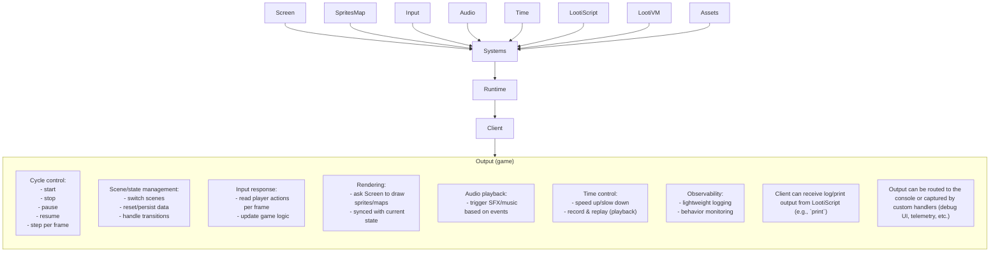

# l8b

l8b is a lightweight, modular web game engine built with TypeScript. It focuses on a consistent runtime (game loop) and separate subsystems for screen, input, audio, sprites, assets, maps, and time, so teams can assemble only the pieces they need and keep their workflow clean and easy to evolve.


**Status**: ready to build client  
**Lead**: nonom
## @l8b/runtime

The l8b runtime is the “brain” that drives the web game frame by frame: it reads input, updates the logic, and then asks the screen to draw the result. It orchestrates the subsystems (screen, audio, input, time, assets) so the game runs consistently and feels responsive.



## @l8b/lootiscript

LootiScript is a lightweight scripting language for games in the l8b ecosystem. Game logic can be written concisely and executed by a VM integrated with the runtime—scripts can read input, change state, and trigger graphics or audio without touching low-level engine details.

- **Focus**: simple syntax, fast execution, easy to use for game behavior.
- **Core components**: tokenizer + parser → AST → compiler → routine/bytecode → runner (threaded).
- **Execution features**: threads, sleep/delay, script function calls (update/draw), repeat/schedule.
- **Script environment**: access to print (log to client), random, and basic List/String/Number utilities.
- **Integration**: call global script functions (update, draw, or others) and wire them to game events.

### Why?

LootiScript is chosen because it offers a concise, controlled way to express game logic on top of the l8b runtime. It focuses on game needs (state, events, update/draw) with a small API surface for clarity, safety, and predictable behavior. With deterministic execution and simple scheduling (sleep/repeat), scripts are easier to debug, pause, and replay. Decoupling scripts from engine plumbing speeds iteration, while built-ins like print, random, and basic utilities keep the experience smooth.

### Compare

**Console/log**

- LootiScript

```livescript
print("Hello from LootiScript")
```

- JavaScript

```jsx
console.log("Hello from JavaScript");
```

**Draw text**

- LootiScript (no boilerplate; uses `screen` API)

```livescript
init = function()
  screen.setFont("PressStart2P")
end

draw = function()
  screen.clear("#0c0c1c")
  screen.drawText("Hello l8b", 0, 0, 10, "#fff")
end

```

- Plain JavaScript (Canvas 2D, no runtime)

```html
<canvas id="c" width="480" height="320"></canvas>
<script>
  const canvas = document.getElementById("c");
  const ctx = canvas.getContext("2d");
  ctx.fillStyle = "#0c0c1c";
  ctx.fillRect(0, 0, canvas.width, canvas.height);

  ctx.fillStyle = "#fff";
  ctx.font = "20px sans-serif";
  ctx.textAlign = "center";
  ctx.textBaseline = "middle";
  ctx.fillText("Hello l8b", canvas.width / 2, canvas.height / 2);
</script>
```

- TSX React

```tsx
import { useEffect, useRef } from "react";

export default function TextCanvas() {
  const ref = useRef<HTMLCanvasElement>(null);

  useEffect(() => {
    const c = ref.current;
    if (!c) return;
    const ctx = c.getContext("2d");
    if (!ctx) return;
    ctx.fillStyle = "#0c0c1c";
    ctx.fillRect(0, 0, c.width, c.height);

    ctx.fillStyle = "#fff";
    ctx.font = "20px sans-serif";
    ctx.textAlign = "center";
    ctx.textBaseline = "middle";
    ctx.fillText("Hello l8b", c.width / 2, c.height / 2);
  }, []);

  return <canvas ref={ref} width={480} height={320} />;
}
```

## Idea Product

Here are 3 product direction options (summarized):

- **L8B as a central platform (similar to Roblox)**
    - **Idea**: A unified editor, asset tools, project system, marketplace, and integrations (multiplayer, web3, DB). LootiScript runtime becomes the execution “core.”
    - **Pros**: End-to-end experience; distribution/monetization via marketplace; strong onboarding for non-technical devs.
    
    ```mermaid
    flowchart TD
        Dev["Developer"] --> L8B["L8B Platform"]
    
        %% Editor Group
        subgraph EDITOR["Editor"]
            direction TB
            IDE["IDE"]
            SpriteEditor["Sprite Editor"]
            MapEditor["Map Editor"]
        end
    
        %% Marketplace (NPM-like)
        subgraph MARKETPLACE["Marketplace (Free / Paid)"]
            direction TB
    
            subgraph ASSET["Asset"]
                direction TB
                AssetMap["Map"]
                AssetSprites["Sprites"]
                AssetEtc["Other Assets (Audio, Models, VFX, etc.)"]
            end
    
            subgraph LIBRARY["Library (Open Package Registry)"]
                direction TB
                Package["Packages / Modules"]
                Tools["Tools / Utilities"]
                Components["Game Components"]
                Systems["Systems / Framework Extensions"]
            end
        end
    
        %% Integrations
        subgraph INTEGRATIONS["Integrations"]
            direction TB
            Web3["Web3 Service"]
            Multiplayer["Multiplayer Service"]
            Database["Database Service"]
        end
    
        %% Project System
        subgraph PROJECT["Project System"]
            direction TB
    
            Manage["Manage Project (Build, Deploy, Logs, Settings)"]
    
            subgraph OUTPUT["Output"]
                direction TB
                DevMode["Dev Mode: [project-id].l8b.gg"]
                ProdL8B["Prod Mode: l8b.gg/[project-id]"]
                ProdCustom["Prod Mode: Custom Domain (Developer)"]
            end
        end
    
        L8B --> EDITOR
        L8B --> MARKETPLACE
        L8B --> PROJECT
        L8B --> INTEGRATIONS
    
    ```
    
- **Open-source framework (Next.js/Vite style)**
    - **Idea**: Modular OSS repo; devs work locally in VSCode; simple integrations; CLI/tooling; publish via npm.
    - **Pros**: Broad accessibility, community contributions, focus on API quality; fast releases; low platform cost.
    - **Risks**: Weak platform “moat”; indirect monetization; requires strong documentation and plugin ecosystem.
- **Hybrid ( phaser style , just sell editor , but ithink we can sell multiplayer service  and db service )**
    - **Idea**: Local dev in VSCode (LootiScript + @l8b/*) with optional cloud services (assets, multiplayer, deploy). Some services free with limitations.
    - **Pros**: Quick start like OSS; added value through managed services; moderate TTM; clear monetization paths.
    - **Risks**: Need to design clear on-prem vs cloud API boundaries; operational overhead for cloud services.

---